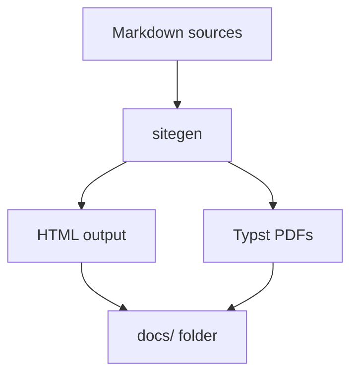
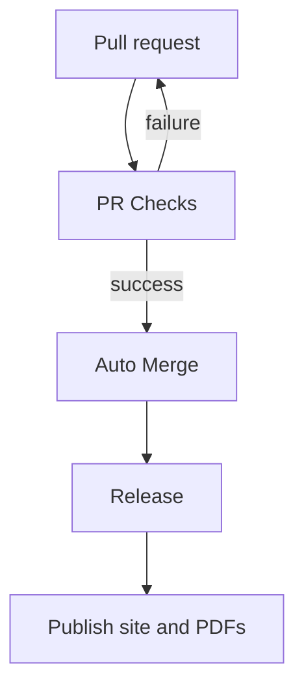

# Architecture Overview

This document outlines how the resume is generated and how the CI/CD pipeline operates.

## CV Generation Workflow
The `sitegen` tool transforms Markdown and Typst sources into HTML pages and PDF files.

## CI/CD Pipeline
GitHub Actions automate checks, merging and releases.

